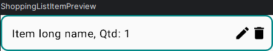
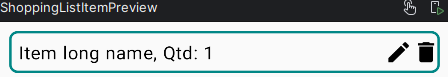

## Intro

- Course: [The Complete Android 14 & Kotlin Development Masterclass](https://www.udemy.com/course/android-kotlin-developer/)
- Language version: Kotlin 1.9.22
- IDE: Android Studio Hedgehog | 2023.1.1 Patch 2
- VM: OpenJDK 64-Bit Server VM by JetBrains s.r.o.

NOTE: The code below is an indistinguishable mix between mine and the teacher's.

## Rock, Paper, Scissors game

Just a Kotlin file implementing a Console program.

```kotlin
enum class Material(val id: UByte) {
    ROCK(1u), PAPER(2u), SCISSORS(3u)
}

fun main() {
    println("Insert your material: ")
    println("1 - Rock")
    println("2 - Paper")
    println("3 - Scissors")

    val userNum: UByte = readln().toUByte()
    val userMaterial = numToMaterial(userNum)

    val randomNum: UByte = (1..3).random().toUByte()
    val randomMaterial = numToMaterial(randomNum)

    println("You choose $userMaterial")
    println("CPU choose $randomMaterial")

    val result: Byte = compare(userMaterial, randomMaterial)
    if (result > 0) {
        print("You win")
    } else if (result < 0) {
        print("You lose")
    } else {
        print("That's a tie")
    }
}

fun numToMaterial(num: UByte): Material = Material.entries.first { m -> m.id == num }

/**
 * Compares materials.
 *
 * Returns:
 *   1, if m1 wins m2
 *  -1, if m1 loses to m2
 *   0, if m1 is equal to m2
 */
fun compare(m1: Material, m2: Material): Byte = when {
    m1 == m2 -> 0
    m1 == Material.ROCK && m2 == Material.SCISSORS -> 1
    m1 == Material.PAPER && m2 == Material.ROCK -> 1
    m1 == Material.SCISSORS && m2 == Material.PAPER -> 1
    else -> -1
}
```

## Bank Account class

Just a Kotlin file implementing a Console program.

```kotlin
class BankAccount(private val accountHolder: String, private var balance: Double) {
    private val transactionHistory: MutableList<String> = mutableListOf()

    init {
        val text = "$accountHolder opened an account with balance R\$ $balance in ${Date()}"
        println(text)
        transactionHistory.add(text)
    }

    fun deposit(amount: Double) {
        var history = ""

        if (amount > 0) {
            balance += amount
            history = "$accountHolder deposited U\$ $amount"
        } else {
            history =
                "Deposit Error: Amount must be greater than U\$ 0. Given amount is U\$ $amount"
        }
        transactionHistory.add(history)
        println(history)
        println("Your balance is U\$ $balance")
    }

    fun withdraw(amount: Double) {
        var history = ""
        if (amount in 0.0..balance) {
            balance -= amount
            history = "$accountHolder withdrew U\$ $amount"
        } else {
            history = "Withdraw Error: The amount U\$ $amount cannot be withdraw."
        }
        transactionHistory.add(history)
        println(history)
        println("Your balance is U\$ $balance")
    }

    fun displayHistory() {
        println("Transaction history of $accountHolder account")
        for (t in transactionHistory) {
            println(t)
        }
    }
}
```

Usage:

```kotlin
fun main() {
    val myAccount = BankAccount("Victor", 0.0)

    myAccount.deposit(-1.0)
    myAccount.withdraw(1.0)
    myAccount.withdraw(-1.0)
    myAccount.deposit(5500.56)
    myAccount.withdraw(2500.0)
    myAccount.withdraw(2500.0)
    myAccount.deposit(1400.0)

    println("")
    myAccount.displayHistory()
}
```

Output example:

```text
Victor opened an account with balance R$ 0.0 in Fri Mar 15 12:30:02 GFT 2024
Deposit Error: Amount must be greater than U$ 0. Given amount is U$ -1.0
Your balance is U$ 0.0
Withdraw Error: The amount U$ 1.0 cannot be withdraw.
Your balance is U$ 0.0
Withdraw Error: The amount U$ -1.0 cannot be withdraw.
Your balance is U$ 0.0
Victor deposited U$ 5500.56
Your balance is U$ 5500.56
Victor withdrew U$ 2500.0
Your balance is U$ 3000.5600000000004
Victor withdrew U$ 2500.0
Your balance is U$ 500.5600000000004
Victor deposited U$ 1400.0
Your balance is U$ 1900.5600000000004

Transaction history of Victor account
Victor opened an account with balance R$ 0.0 in Fri Mar 15 12:30:02 GFT 2024
Deposit Error: Amount must be greater than U$ 0. Given amount is U$ -1.0
Withdraw Error: The amount U$ 1.0 cannot be withdraw.
Withdraw Error: The amount U$ -1.0 cannot be withdraw.
Victor deposited U$ 5500.56
Victor withdrew U$ 2500.0
Victor withdrew U$ 2500.0
Victor deposited U$ 1400.0
```

## Composable Elements

A composable element is a piece of the UI built in a declarative way. An UI is built using the pre-implemented composables in `androidx.compose` package and the custom ones that the programmer has defined. Some examples of the existing ones are:

- Row, in `androidx.compose.foundation.layout.Row`
- Spacer, in `androidx.compose.foundation.layout.Spacer`
- Icon, in `androidx.compose.material3.Icon`
- Text, in `androidx.compose.material3.Text`

A custom composable can be defined as below:

```kotlin
@Composable
fun Item() {
    Row {
        Column {
            Button(onClick = {}) {
                Text(text = "Text")
            }
        }
    }
}
```

Each composable is a function annotated with the word `@Composable`, can receive parameters to manage its state and behavior, and has a well declared interface that can be reused as many times as necessary.

Composables usually has the `modifier` argument. This is the way Jetpack Compose applies visual styling such as internal and external spacing, border, shape and color. The modifiers are applied in the order they are defined. That means this code with `padding(8.dp)` after the `border`:

```kotlin
Row(
    modifier = Modifier
        .fillMaxWidth()
        .border(
            border = BorderStroke(2.dp, Color(0xFF018786)),
            shape = RoundedCornerShape(20)
        )
        .padding(8.dp),
) {
    Text(
        text = "Item long name, Qtd: 1",
    )
    Spacer(modifier = Modifier.padding(horizontal = 8.dp))
    Row {
        Icon(imageVector = Icons.Filled.Edit)
        Icon(imageVector = Icons.Filled.Delete)
    }
}
```

Produces this UI:



That is different to this code with `border` after the `padding(8.dp)`:

```kotlin
Row(
    modifier = Modifier
        .fillMaxWidth()
        .padding(8.dp)
        .border(
            border = BorderStroke(2.dp, Color(0xFF018786)),
            shape = RoundedCornerShape(20)
        ),
) {
    Text(
        text = "Item long name, Qtd: 1",
    )
    Spacer(modifier = Modifier.padding(horizontal = 8.dp))
    Row {
        Icon(imageVector = Icons.Filled.Edit)
        Icon(imageVector = Icons.Filled.Delete)
    }
}
```

Which produces this result:



## State management

TODO

## Unit Converter

This project is a form with a text input and two dropdown menu. Below the form is positioned the result text.
The text input is meant to insert a valid real number. Both dropdown menus are used to select two separate distance unit, the input measurement unit and the output measurement unit. The options are:

- Centimeter
- Meter
- Foot
- Millimeter

The result is calculated in three steps:

- Cast the value in the text input from `String` to `Double`
- Knowing the inputted value and the input unit, convert that to meters
- Knowing the value in meters, convert that to the output unit

That conversions are done by the methods `convertToMeter` and `convertFromMeter`:

```kotlin
fun convertToMeter(value: Double, inputUnit: String): Double {
    return when (inputUnit) {
        "Centimeters" -> value * 0.01
        "Meters" -> value
        "Foot" -> value * 0.30479
        "Millimeters" -> value * 0.001
        else -> 0.0
    }
}

fun convertFromMeter(valueInMeters: Double, outputUnit: String): Double {
    return when (outputUnit) {
        "Centimeters" -> valueInMeters * 100
        "Meters" -> valueInMeters
        "Foot" -> valueInMeters * 3.28084
        "Millimeters" -> valueInMeters * 1000
        else -> 0.0
    }
}

fun calcResult() {
    val inputValueDouble: Double = inputValue.toDoubleOrNull() ?: 0.0
    val valueInMeters = convertToMeter(inputValueDouble, inputUnit)
    outputValue = convertFromMeter(valueInMeters, outputUnit).toString()
}
```

The UI was built in a composable way, that is, joining small components together to compose a larger interface.

Here is an example of a custom `DropdownMenu` that receives its display texts and behavior in form of methods:

```kotlin
@Composable
fun UnitDropDownButton(
    isExpanded: Boolean,
    label: String,
    onClick: () -> Unit,
    dropDownLabels: List<String>,
    onDropdownMenuItemClick: (String?) -> Unit
) {
    Box {
        Button(onClick = onClick) {
            Text(text = label.ifBlank { "Select" })
            Icon(Icons.Default.ArrowDropDown, contentDescription = "Arrow Down")
        }
        DropdownMenu(expanded = isExpanded, onDismissRequest = { onDropdownMenuItemClick(null) }) {
            dropDownLabels.map {
                DropdownMenuItem(
                    text = { Text(text = it) },
                    onClick = { onDropdownMenuItemClick(it) },
                )
            }
        }
    }
}
```

Below you can see the same showcase present in the [remote repository](https://github.com/victorers1/unit-converter-jetpack-compose/tree/main), which contains the whole project:


## Shopping List App

It's an app that saves shopping items and its quantity in a list. Items can be edited and deleted. The `ShoppingItem` data class is:

```kotlin
data class ShoppingItem(
    val id: Int,
    var name: String,
    var quantity: Int,
)
```

To add or edit an item, the app opens the dialogs `AddItemDialog` and `EditItemDialog` respectively. In contrast with the last "Unit Converter" project, all composables in this project was placed in a different file, for organization. To achieve this, all data and behavior that each composable needs to properly work, have to be given through function params. Below, the example of `DialogTextField`:

```kotlin
@Composable
fun DialogTextField(
    value: String,
    label: String,
    placeholder: String,
    onValueChange: (String) -> Unit,
) {
    OutlinedTextField(
        value = value,
        onValueChange = onValueChange,
        placeholder = { Text(text = placeholder) },
        singleLine = true,
        label = { Text(text = label) },
        modifier = Modifier
            .fillMaxWidth()
            .padding(8.dp)
    )
}
```

### Mutable List State

One thing learned in this project is that although we manage state using the function `mutableStateOf()`, we have to treat these variables as immutable. That is, in order to Jetpack Compose detect a change in state and update the screen, these values has to be overwritten. That seems to be obvious when working with primitive type variables, but it's even more clear when working with iterable structures like `List`s.

In this project, we had to declare `var shoppingItems by remember { mutableStateOf(listOf<ShoppingItem>() }`. To add items to `shoppingItems`, we couldn't simply do an in-place operation by adding an element at the end of the existing list. We had to create a copy of the existing list, insert the new item at the end, and then, overwrite the existing state in `shoppingItems` with the new one.

That is also the case if you want to change one of the element's attribute, like `name`. You must create the new copy of that element, create a new list with the new element inserted, and then, overwrite the `shoppingItems` variable.

Below you can see the same showcase present in the [remote repository](https://github.com/victorers1/shoppinglist-jetpack-compose), which contains the whole project:


## Counter App with MVVM

Yeah, I know it's just a goddamn counter app, but the reason I done this is to test the MVVM architecture in android's Jetpack Compose.


## Recipe App

It's a single page app that loads meals categories information from the site `https://www.themealdb.com`. The API returns a JSON containing a bunch of meals categories. Each one has an id, an image URL, a name and a description.

When any category is clicked, the details page opens, showing the name, image and the description.

### External Packages

We're using:

- `androidx.lifecycle:lifecycle-viewmodel-compose:2.7.0` to work with View models
- `com.squareup.retrofit2:retrofit:2.10.0` to do network calls
- `com.squareup.retrofit2:converter-gson:2.10.0` to convert JSONs to Kotlin object mapping
- `io.coil-kt:coil:2.6.0` to load images from URLs

### Requests

We created a service interface to serve as the contract used in the whole app to do network request. The service internally uses Retrofit plugin, but the rest of the app doesn't need to know this.

```kotlin
private val retrofit = Retrofit.Builder().baseUrl("https://www.themealdb.com/api/json/v1/1/")
    .addConverterFactory(GsonConverterFactory.create()).build()

var recipeService: ApiService = retrofit.create(ApiService::class.java)

interface ApiService {
    @GET("categories.php")
    suspend fun getCategories(): CategoriesResponse
}
```

### Image Loading

To load an Image from a given URL, we're using the `coil.compose.rememberAsyncImagePainter` function as seen below:

```kotlin
@Composable
fun MealCategoryItem(mealCategory: MealCategory) {
    Column {
        Image(
            painter = rememberAsyncImagePainter(mealCategory.strCategoryThumb),
        )
        Text(
            text = mealCategory.strCategory,
        )
    }
}
```

### Navigation

In order to navigate from a screen to another, we've built a `RootScreen` to serve as a container to the navigation stack, it's the page that is never popped and every page is on top of it. The root, contains only a `NavHost`, responsible for stacking the others Composables, like `HomeScreen` and `CategoryDetailsScreen`. `NavHost` works with named route, like the web. Below, it's the simplified version of the `RootScreen`:

```kotlin
@Composable
fun RootScreen() {
    val navController = rememberNavController()
    val homeScreenViewModel: HomeScreenViewModel = viewModel()
    val homeScreenState by homeScreenViewModel.homeScreenState

    NavHost(navController = navController, startDestination = "homeScreen") {

        composable(route = "homeScreen") {
            HomeScreen(
                viewState = homeScreenState,
                navigateToCategoryDetailsScreen = {
                    navController.navigate("detailsScreen")
                }
            )
        }

        composable(route = "detailsScreen") {
            CategoryDetailsScreen(
                navigateToHomeScreen = { navController.popBackStack() }
            )
        }
    }
}
```


## Location App

TODO
